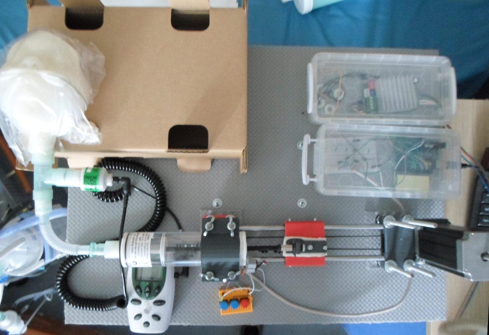
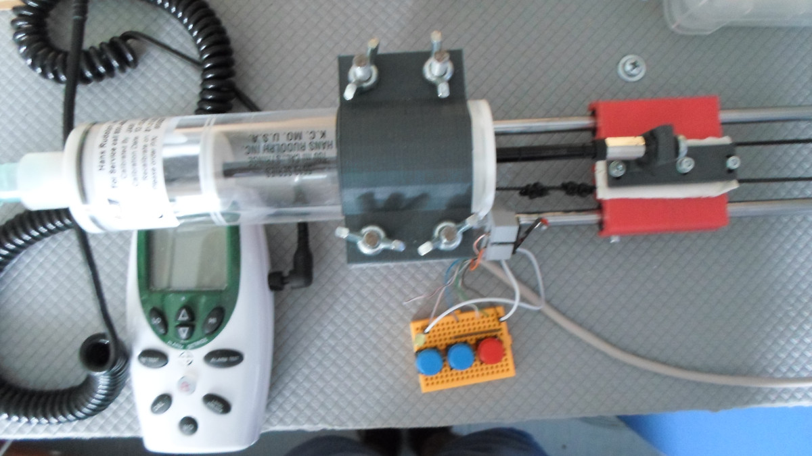
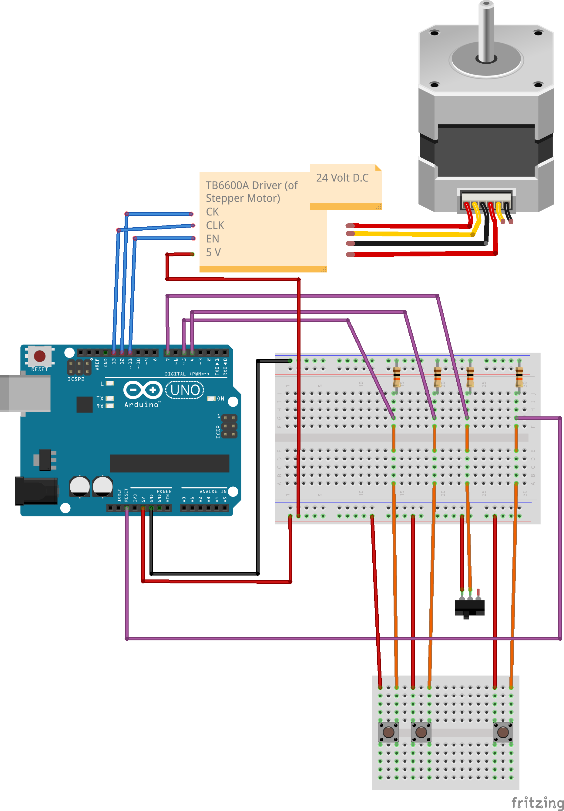
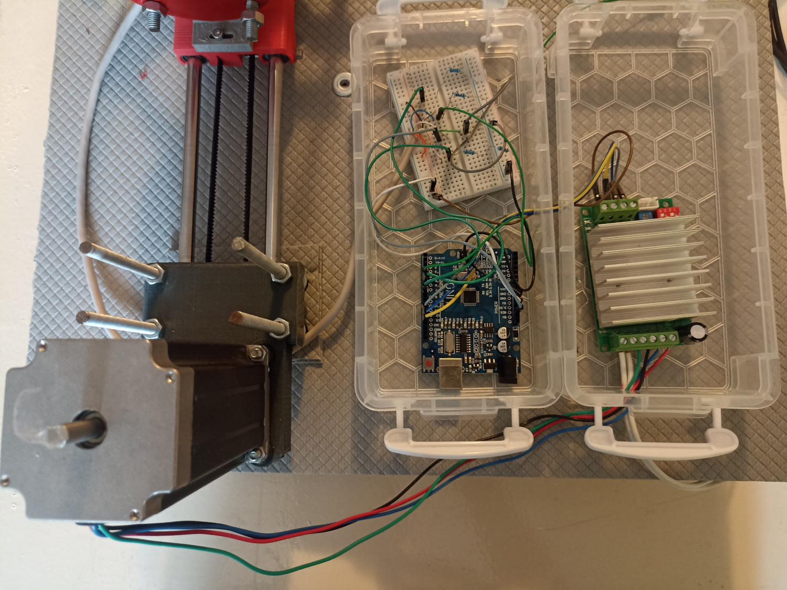
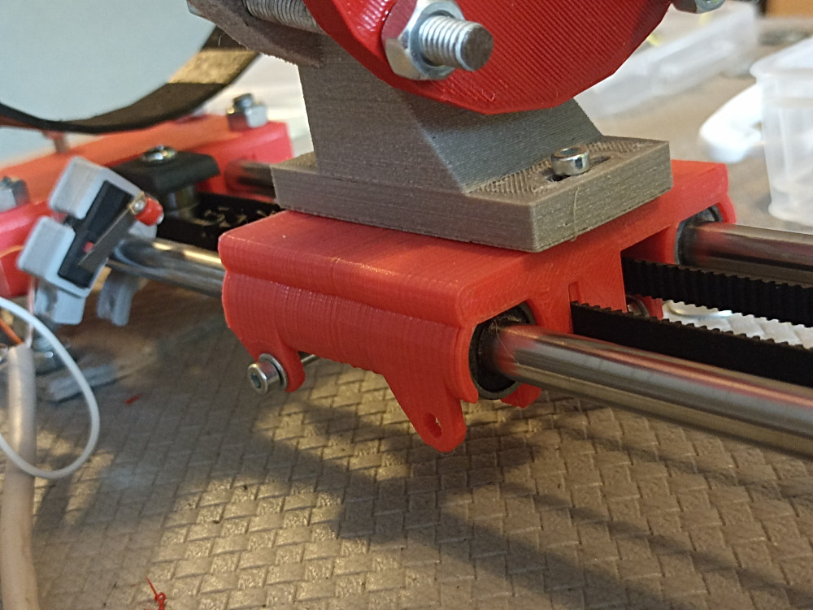

# Documentation of Infant Breath Mechanical Simulator

Construction and use

 

[https://github.com/arisberd/Infant-breath-mechanical-simulator](https://github.com/arisberd/Infant-breath-mechanical-simulator)

version 0.2

GNU GPL v3

## Table of contents

[TOC]

## General

Infant breath mechanical simulator is a low-tech device designed to facilitate respiratory experiments. Its hardware design is primarily based on RepRap Prusa Interation 3, specifically utilizing its X-axis components. Therefore, the majority of the hardware components are similar to that of a typical 3d printer with a single axis. The device is powered and controlled using  Arduino electronics, providing precise motor movement and enabling computer communication.

# Getting Started

## Project's origin

This is a developing project and was initiated in the Pediatric Department of University Hospital of Patras, Greece in 2021. While this documentation provides comprehensive instructions for construction and use, please be aware that this is a developing project, so issues may arise. 

## Required skills:

To successfully operate this project, you should possess a basic understanding of the following:

* 3d printing: familiarity with 3d printing techniques, equipment and slicing
* Arduino electronics: basic skills of Arduino wiring and program uploading
* Software skills: basic software skills during the first setup, in order to configure the program file

## Community Collaboration

We encourage you to participate in and contribute to the project's development under GPL3 lincense. If you have questions or insights, feel free to contact with [project's community](https://github.com/arisberd/Infant-breath-mechanical-simulator/issues).

### Bill of materials

Electronics:

* Arduino Uno
* Stepper Motor Driver (TB6600A used)
* DC Power supply (24 volt used)
* Breadboard Buttons (2 blue, 1 red)
* Arduino wires, resistants and breadboards

Mechanical Components:

* Stepper Motor 56mm, high torque motor (Wantai NEMA 23 used, 30kg.cm)
* GT2 Gear (40teeth)
* GT2 Belt
* Endstop switch
* Linear bearing 8mm (4 pieces)
* Ball bearing 3mm inner diameter (2 pieces)
* Rods 8mm (2 pieces)
* Wooden frame at least 30 X 40 cm
* Callibration syringe (100ml or 1000ml)

Fasteners:

* M3 bolts and nuts
* M4 bolts and nuts
* M8 bolts and nuts
* A double nut (only at Hole method)

3D printing:

* PLA/PET 3d print filament

## Printing parts

### Overview

In this section you can find 3d-printed STL files required for assembling Infant Breath Mechanical Simulator. These file are available in the `3d_printed_parts/Stl rendered files` folder. These stl files are rendered based on [openscad](http://openscad.org/downloads.html) files, where customization can be made. `Compact_endstop.stl` is made and downloaded by `https://www.thingiverse.com/chri/designs`. 

### 3d Slicing preparation

Before 3d printing, it's vital to prepare the STL file, using a slicing software. We recommend [Prusa Slicer](https://www.prusa3d.com/page/prusaslicer_424/). Printing at `layer height 0.3mm` and `nozzle 0.4mm` was found decent.

### List of 3d-printed files:

* `Axis based on x-end.stl` this file contains 3 models for the one-axis static compartment.
* `x-carriage.stl` is the moving part on the rods.
* `compact_endstop.stl` this part hosts the endstop switch.
* `syringe_attacher_with_flange.stl` and `syringe_attacher_only_the_flange.stl` are used for grapping the syringe with a flange system. Otherwise you can use next file:
* `syringe_attacher_with_hole.stl` this file secures syringe by using a hole and a double nut
* `syringe_base_100ml.stl` mounts a 100ml syringe. You should print at least a pair of them for stability
* `syringe_base_1000ml.stl` mounts a bigger (1000ml) syringe. Again at least a pair of them is needed.

 

## Flange or hole method

 

There are two methods for attaching the syringe's plunger on the machine: 

* The **flange method** involves using two printed parts to secure plunger's *hand* in place. This method is suitable for calibration syringes where the plunger's hand cannot be detached. Place the plunger's hand between the two 3D-printed parts and use M8 bolts and nuts for securing all together . We used a **1000ml syringe** with this method. 

 

* The **hole method** is used when the syringe's piston has a threaded end, and the plunger's hand can be unscrewed. With this method, only one 3D-printed part is used. A double nut is used to secure the plunger to the 3d print part. We used a **100ml syringe** with this method.

 
 

## Electronics

Basic module of the project is an [Arduino Uno](https://store.arduino.cc/products/arduino-uno-rev3). Wiring is shown in the following photo:

 
 

* The motor's Driver (TB6600A) is connected at arduino digital pins as shown. Driver also connects to a 24 Volt DC current as well as the Stepper Motor. Be sure to adjust Driver's current sparingly, starting at very low currents and slowly increase at first test. You should also check the microstepping setting. The software's default is 1/8 microstepping (can be changed in software, too). At the following pictures, the arrow show the microstepping switches. We used 8 microsteps. Refer to the datasheet for choosing the correct combination for microstepping.

 
 

* Endstop and Buttons are connected as shown in the picture. A wire extension should be used. Note at endswitch should be connected as open-circuit when not pressed. At the following picture an ethernet cable extension is used (contains 8 wires). Note that the blue button No1 is used for changing rows in the experiment, whereas the blue botton No2 is used for pause. Red button is used for hardware reset, and is connected to the reset button of the arduino.

 

Note that both 5 Volt and 24 Volt D.C. circuits are used in this project. 24 Volt is only used at motor's Driver, whereas the 5 Volt is used at almost all modules. The 5 Volt can be produced either by the USB of arduino or direct arduino power. 

## Hardware assembly

NOTE: This project is based on RepRap Prusa Interation 3, as a modified X axis. More instructions based on a x-axis of a 3d printer can be found [here](https://reprap.org/wiki/RepRapPro_Huxley_x_axis_assembly), but use this guide for reference only, as many things are not similar.

1.Frame Setup:

A wooden frame of at least 30 X 40 cm should be used as a base. This frame will hold things together. The way to fix them in place is using M8 bolts and nuts on 3d-printed parts.

2.Thightener:

Start by assembling the `tightener`, which is the small part of the `Axis based on x-end.stl`. This part is crucial for tighten the belt more that can be done by hand. Put a M3 bolt and nut so that the 2 ball bearings hold together at the end of the `tightener`. Put another M3 (or M4) bolt on the other side. This bolt is going to adjust the tension.

 

3.Carriage assembly and Axis: 

Then you should assembly the `x-carriage.stl`. Belt is attached to this piece so it can be moved up and down on the rods. A second 3d-printed piece will hold the plunger of the syringe, and will be attached upon `carriage`. Start by fitting the 4 linear bearings (3 can also be used) and secure the with M3 bolts and nuts. Attach the one side of the belt at the slot under the `x-carriage.stl`. The other side is to be attached later. Insert the rods to the linear bearing taking care not to damage the bearing. On either side of the rods attach the rest parts of the `Axis based on x-end.stl` by pushing the rods gently. Then you should choose of the two methods of plunger attachment : flange method or hole method. Read also `Flange of hole method`. Take the appropriate 3d-printed part and secure it on `carriage` using three M3 bolts and nuts.  This will appear like the following photo:

 

4.Securing to Wooden Frame:

The two 3d-printed sides of apparatus should be now fixed to the wooden frame. Using M8 bolts and nuts thighten up and fix the in place. 

5.Stepper Motor install:

Fit the 56mm Stepper Motor and secure it using M4 bolts and nuts. Attach the gear and tighten its bolt.

 

6.End-stop switch:

Using end-stop switch the system can understand the starting position of the syringe. This is usually a position with little starting air volume. Attach the end-stop switch in the left side of a rod and rotate it so carriage can press the switch button when moved. You can secure the switch with M3 bolts and nuts, or do this job later, in order to test accurate starting volume. 

7.Belt:

Put on the `thightener` at the one side of the apparatus. Pull the belt under the gear at one side and under the `thightener`'s bearings on the other. Then pull belt back under the carriage and fix it properly. Make this first by hand as tight as possible and then tighten more using the side bolt of the `tightener`.

8.Securing syringe:

After reading **Flange or hole method**, choose your printing file between `syringe_base_100ml.stl` and `syringe_base_1000ml.stl`. You will need at least one pair of these. Attach one of the printed files to the wooden frame using M8 bolts and nuts. Take care that bolts are long enough: put the syringe on printed-base and on-top put a second printed-base. Using the same bolt secure wooden frame to both printed parts. You can use a second pair of printed parts to secure syringe in the other side.

 
 

9a. **Flange mode** - Securing the plunger:

Bring all pieces in place: the `syringe_attacher_with_flange.stl` then the handle of the plunger and then the `syringe_attacher_only_the_flange.stl`. These 3 are going to be secured using M8 bolts and nuts. Secure them one by one, taking care not to be very tighted and damage the handle, whereas not being to loose.

9b. **Hole method** - Securing the Plunger:

Things are going to be more stable using the hole method. A long nut at the size of plunger's bolts is going to be needed. First attach this nut at the plunger and then using another bolt, through the 3d printed file syringe_attacher_with_hole.stl. Secure things together.

 

### Beyond Syringe

The syringe can move air to any other compartment. During first setup, an model of infant airway was used as showed in the following photo.

 

### Final hardware aspects

Your hardware setup is ready by this point. Before proceding to software installation and first run, take care to examine all moving parts in order or avoid damage due to misuse:

* Check the belt to be tight enought,

* Move the carriage with your hand slow enough and check if the piston of the syringe move smoothly, in a complete linear movement. It should not take any vertical forces.

* Check the position of carriage when moved and press the end-stop switch, so it does not damage the syringe.

* If using flange method, the handle must be tighted locked between the 3d printed parts and check if as it moves, so it does not get damage. 

## Software

### Arduino IDE

Each specific movement of the carriage will produce distinct respiratory cycle and this is going to be configured through software. Arduino is used not only to control all electronics but also to manage data. To get started, you will need the Arduino software, known as [Arduino IDE](https://www.arduino.cc/en/Guide). This computer software enables to upload programs to Arduino board. Here are the steps:

1. **Download Arduino IDE**: visit the [Arduino IDE download page](https://www.arduino.cc/en/software) to download the software.

2. **Configuration Guide**: Take some time to feel comfortable with Arduino IDE and review the available [documentation](https://www.arduino.cc/en/Guide). This will help you understand how Arduino IDE communicates with Arduino board, including which ports you will need to use and how to select the appropriate Arduino board.

3. **Opening the project's file**: Though Arduino IDE, open the `breath-sim.ino` file of the project. This file contains the code necessary to control arduino board. At this step you don't need to open datasheets that are stored in different files. 

4. **Uploading to Arduino Board**: Connect your Arduino board to your computer using a USB cable. In Arduino IDE, select the correct port and Arduino Board Model and click the *Upload* button. If everything is set corrrectly, then a message will be shown in Arduino IDE terminal to configure a successful upload.

5. **Serial Monitor**: After uploading, you can use Serial Monitor to monitor Arudino's function and send commands. You can open it from Arduino IDE, as long as USB is connected and a prompted upload has been done.

### Data

Data for is stored in seperated files that work as datasheets. By default, `dataleo2.h` is used for this purpose. The data is stored in specific format as outlined in the beggining of datasheet files. These include:

* **VT** (Volume Tidal): this represent the amount of air in **milliliters** (ml) moved in a single breath

* **Ti** (Time of Inspiration): this indicates the time in **milliseconds** of the inspiration phase

* **Te/Ti ratio** (Time of Expiration to Time of Inspiratio ratio): this ratio defines the duration of expiration compared to duration of inspiration, expressed as a percentage. 

All values in datasheets are seperated by commas (,). Each set of these data values forms a row, which corresponds to a specific respiratory cycle. For example in `dataleo2.h`, the first row reads as follows: `80  , 300 , 185 ,`. This configuration results in a respiratory cycle of 80ml, with inspiration time of 300 msec and Te/Ti ratio of 185%. By using mathimatical calculations, you can derive expiration time, which is 555msec in this example, and respiratory rate which is 70/sec. 

You can navigate through different respiratory profiles, by pressing blue button No. 1, which allows you to switch to next rows in the datasheet. In `dataleo2.h` the second row is `80  , 300 , 150 ,`  and differs in Te/Ti ratio only. `Dataleo2.h` datasheet is based on typical breathing parameters for infants.

## Configuration setup before first run

Now its time for your first run! You should check the following list before first run and do some callibration. If you make changes in datasheets or `breath-sim.ino` file, make sure you upload it again. All you will need to configure appear in the first code lines of `breath-sim.ino`. Open it with Arduino IDE and check the values as follows:

### `float steps_to_vol = 3.33 * microsteps * calibration_vol;` 

This values converts number from datasheets (volume) to movement in motor (steps). 3.33 means that 3.33 motor steps are needed for 1 ml air. You may need to change this value if you work with different motor gear (ex. smaller gear will need more steps for the same volume) or different syringe (a bigger syringe will need less steps for the same volume). The correct number you will need to put is found with trial-and-error method. Start by this number if you are using documentation's preset with a 100ml syringe. For smaller gear, try double the value. For bigger syringe, start with 1/15 of the value. Set a number of volume and check how much is moved. Then make corrections and repeat the process. Be careful not to start with big values, because an unexpected fast and long movement can occur.

### `int starting_volume = -6;` 

This is the starting amount of volume you want to set. When the machine runs, it find the end-stop switch and then move -6ml from that place. Change this as it fits your needs

### `int microsteps = 8;` 

This counts the microsteps that is set. If you switch to more microsteps, for example 16, you will need to change this value

### `float calibration_vol = 0.95418 ;` 

This variable serves as fine-tuning calibration parameter. After configuring the correct `steps_to_vol` value, it is important to ensure accurate volume measurements within your setup. To achieve this, you will require a pneumotachograph, a seperated device used for precise volume measurements. Follow these steps:

1. Connect a pneumotachograph to the syringe.

2. Conduct accurate volume measurements with the pneumotachgraph and compare them to the predefined target volumes of datasheet. For instance, if your measurements read `78ml` while the target volume is `80ml`, calculate the ratio 80/78 = 1,025641026.

3. Set calculated ratio as a new value for `calibration_vol` and upload the program on Arduino.

4. Repeat this process until your measurements align closely with the target volumes. Keep in mind that the second time you will need to multiply the new factor with the last one used.

### Arduino I/O pin connections 

Arduino I/O pin connections are set in the begining of `breath-sim.ino`. In the begininng of breath-sim.ino file, you'll find the default configuration as shown before. If, at any point, you need to modify these pin connections to accommodate changes in your electronic wiring, you can easily make these adjustments in this section of the code. Be sure to save and update the program on Arduino.

## Checkup list before first run

You are ready for the first run. Before you proceed, make sure to perform the following checks:

* **Begin with small volumes** and set small float `steps_to_vol` values to prevent potential damage due to high speed moves.

* Verify that all hardware **nuts are tightened** securely.

* Make sure that **carriage does not come in contact** with any part of the syringe or end stop during its movement.

* Make sure that **syringe piston** is moved smoothly and is properly aligned.

* Note that **end-stop-switch** can be pressed by carriage on its movement.

* Initially, use **low current setting** on the motor driver and increase it gradually after the first use.

* **Plug arduino USB** (5V)  or 9V current and be prepared to connect the 24V Motor's current when prompted.

* Open **Serial Monitor** to monitor status and output from the Arduino.

## Using Infant Breath Mechanical Simulator 

You can make experiments with air movement using Infant Breath Mechanical Simulator. Set up a datasheet according to your needs. After a prompt upload, you will see a welcome message in Serial Monitor. Before starting the experiment you will be asked to plug in 24V current and press the Blue button No 1. While running, you are going to read messages of status in Serial Monitor.

* **Blue Button No 1**: Press this button to switch to another row. You will face a change in movement pattern. By default, it advances to the next row until the last and loops back to the beginning. You can manually switch to a specific row but entering the row number in the Serial Monitor and pressing enter. Then, the next time you press Blue Button No 1, it will get to that row.

* **Blue Button No 2**: Use this button to pause experiment. You can resume it with the same button later as needed.

* **Red Button**: This button serves as a hardware reset. It performs the same function as unplugging and re-plugging the Arduino USB connection, effectively restarting the program.
